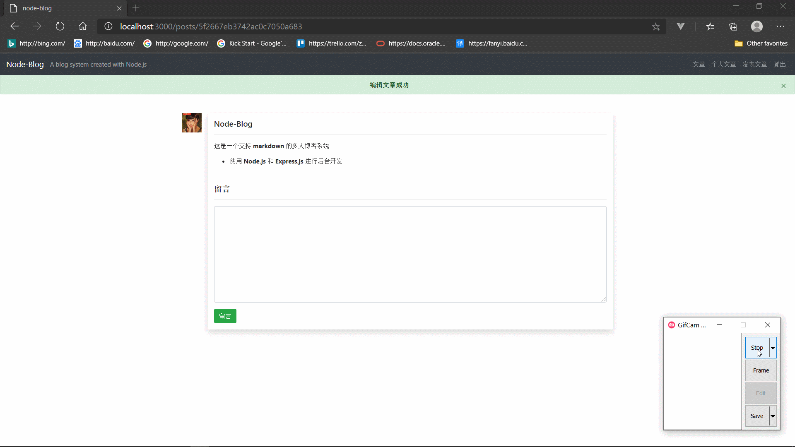

# Node Blog

## 介绍

基于 **`Node.js`** 和 **`Express.js`** 框架设计的一个简单的, 支持 **markdown** 语法的多人博客系统.
系统遵循 **MVC** 模式设计, 带有注册, 登录, 登出, 发表/查看/更新/删除博客, 添加/删除留言的功能. 项目使用了 **MongoDB** 作为数据库, 并使用 **`mongoose`** 进行数据库连接和操作. 后端接口遵循了 **RESTFUL API** 的设计风格, 前端页面采用了**服务端渲染**的方式, 利用 `Express.js` 的 `render` 函数、 **`ejs`** 模板、 **`bootstrap`** UI 框架 完成了前端页面的绘制.

## Demo

### 注册 登出 登录

### 博客发表/查看/更新/删除

### 留言添加/删除

## 项目设计过程

### 后端接口

实现 Restful API, 前端交互通过简单的 `<a>`标签 (GET) 和 表单 (POST) 与后端进行交互

1. 注册
   * 注册页 : `GET /signup`
   * 注册 : `POST /signup`
2. 登录
   * 登录页 : `GET /signin`
   * 登录 : `POST /signin`
3. 登出 `GET /signout`
4. 文章
   * 发表文章
     * 发表文章页 : `GET /posts/create`
     * 发表文章 : `POST /posts/create`
   * 查看文章
     * 主页 : `GET /posts`
     * 个人主页: `GET /posts?author=xxx`
     * 查看一篇文章 : `GET /posts/:postId`
   * 修改文章
     * 修改文章页 : `GET /posts/:postId/edit`
     * 修改文章 : `POST /posts/:postId/edit`
   * 删除文章 : `GET /posts/:postId/remove`
5. 留言
   * 创建留言 : `POST /comments`
   * 删除留言 : `GET /comments/:commentId/remove`
